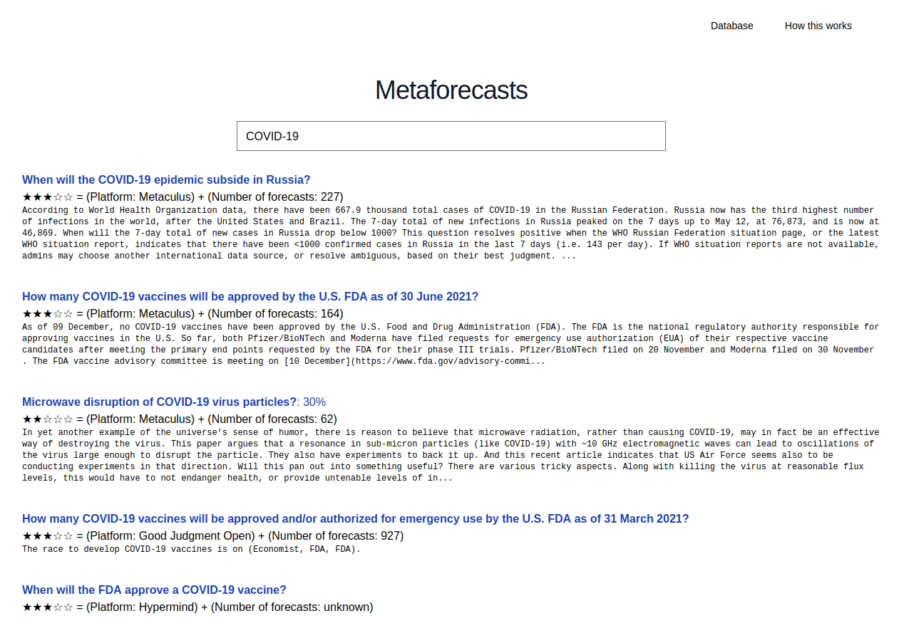

## What this is 

This is a set of libraries and a command line interface that fetches probabilities/forecasts from prediction markets and forecasting platforms. These forecasts are then hosted on airtable, and used to power a search engine for probabilities. 

Eventually, this could become more elaborate; for example, forecasts could be ranked according to their quality. For now, a demo can be found [here](https://metaforecast.org/) (try searching "Trump", "China" or "Semiconductors"), and the database can be perused [here](https://metaforecast.org/metaforecasts/data/). I also have a json endpoint [here](https://metaforecast.org/data/metaforecasts.json) and a csv endpoint [here](https://metaforecast.org/data/metaforecasts.csv).

## How to run

### 1. Download this repository

``git clone https://github.com/QURIresearch/metaforecasts``

### 2. Enter your own cookies
Private session cookies are necessary to query CSET-foretell, Good Judgment Open and Hypermind. You can get these cookies by creating an account in said platforms and then making and inspecting a request (e.g., by making a prediction, or browsing questions). After doing this, you should create a `src/privatekeys.json`, in the same format as `src/privatekeys_example.json`

### 3. Actually run

From the top level directory, enter: `npm run start`

## Various notes

- Right now, I'm fetching only a couple of common properties, such as the title, url, platform, whether a question is binary (yes/no), its percentage, and the number of forecasts. However, the code contains more fields commented out, such as trade volume, liquidity, etc. 
- A note as to quality: Tentatively, Good Judgment >> Good Judgment Open ~ Metaculus > CSET > PredictIt ~> Polymarket >> Elicit > Omen. Further, prediction markets rarely go above 95% or below 5%. I'm not really sure where Hypermind falls in that spectrum.
- For elicit and metaculus, this library currently filters questions with <10 predictions.
- Omen *does* have very few active predictions at the moment; this is not a mistake. 
